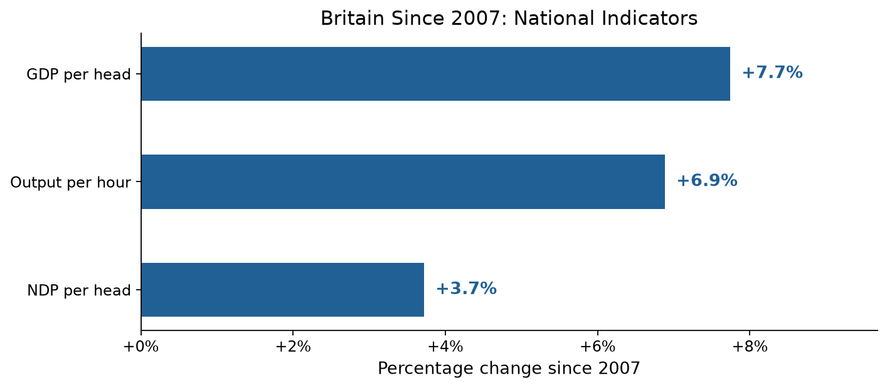

# Britain Since 2007: Evidence Report

**UK Economic Change Comparison Framework — Proof of Concept**  
July 2026 | Data source: Office for National Statistics

---

## Executive Summary

This report compares Britain's economic position in 2007 — the peak before the global financial crisis — with the latest available data. It draws on three national indicators and twelve regional productivity measures, all sourced directly from the Office for National Statistics and processed through a reproducible pipeline.

### Headlines

- **GDP per head** rose from £37,625 in 2007 to £40,537 in 2025 — a gain of just **7.7% over 18 years**, or 0.4% per year. Before the crisis, growth averaged 2.3% per year.
- **Net domestic product per head** grew at less than half that rate (+3.7%), suggesting that capital consumption — depreciation, obsolescence — absorbed an increasing share of output.
- **Output per hour worked** — the standard measure of labour productivity — rose only 6.9% over the same period. Before 2007, productivity grew at 2.1% per year.
- **Regional inequality is narrowing**, but slowly. Scotland and Northern Ireland recorded the strongest convergence gains, while London's relative advantage shrank. Yet London remains nearly 29% above the UK average.

The evidence confirms that Britain's post-2007 economic performance represents a structural break from the pre-crisis trend — not a temporary deviation.

---

## 1. National Output: GDP per Head

### The headline figure

Real GDP per head stood at **£37,625** in 2007. By 2025, it had risen to **£40,537** — an increase of £2,912, or **7.7%**.

| | 2007 | 2025 | Change |
|---|---|---|---|
| GDP per head (CVM, 2023 prices) | £37,625 | £40,537 | +£2,912 (+7.7%) |

### The trend matters more than the headline

The total change masks a far more revealing story when placed in context. Between 1997 and 2007, GDP per head grew at a compound annual rate of **2.3%**. Had that trend continued, GDP per head would stand at roughly **£55,000** today — a gap of about £14,500 per person compared with what actually materialised.

Instead, the compound annual growth rate since 2007 has been just **0.4%** — a near-total collapse in the pre-crisis trend.


**Figure 1:** GDP and NDP per head, 2007–2025, chained volume measures at 2023 prices. The chart shows three distinct phases: the 2008–09 financial crisis contraction, a slow recovery through the 2010s, the 2020 COVID shock, and a modest post-pandemic recovery. NDP per head (GDP minus capital consumption) consistently tracks below GDP, with the gap widening over time.

### Why it matters

A 0.4% annual growth rate implies that GDP per head doubles roughly every 175 years. At the pre-2007 rate of 2.3%, it would double every 30 years. The difference is not a rounding error — it represents a fundamentally different economic trajectory that affects living standards, public finances, and fiscal sustainability.

---

## 2. National Income: NDP per Head

### GDP is not the whole story

Gross Domestic Product measures total output, but it does not account for the wear and tear on the capital stock that produces that output. **Net Domestic Product (NDP)** subtracts capital consumption — depreciation of buildings, machinery, infrastructure, and intellectual property — to give a measure closer to sustainable national income.

| | 2007 | 2025 | Change |
|---|---|---|---|
| NDP per head (CVM, 2023 prices) | £33,070 | £34,300 | +£1,230 (+3.7%) |

NDP per head grew by only **3.7%** — less than half the rate of GDP per head. The gap between GDP and NDP per head widened from £4,555 in 2007 to £6,237 in 2025.

### Interpretation

This widening gap suggests that a growing share of Britain's economic output is being absorbed by capital consumption — maintaining, replacing, and depreciating the existing capital stock — rather than generating new net income. Several factors may contribute:

- An ageing capital stock requiring higher maintenance.
- Shorter asset lives in technology-intensive industries.
- Measurement changes in how capital consumption is estimated.
- Genuinely higher depreciation rates in a more service-oriented economy.

Whatever the cause, the divergence means GDP per head **overstates** the improvement in sustainable living standards since 2007 by a factor of roughly two.



**Figure 2:** Percentage change in the three national indicators since 2007. GDP per head leads at +7.7%, followed by output per hour at +6.9%. NDP per head trails at +3.7%, highlighting the growing wedge between gross and net measures of national income.

---

## 3. Productivity: Output per Hour Worked

### The stagnation is real

Labour productivity — output per hour worked — is the foundation of long-run improvements in living standards. When productivity grows, wages can rise without inflation, tax revenues increase without rate rises, and the economy can absorb cost pressures without losing competitiveness.

| | 2007 | 2025 | Change |
|---|---|---|---|
| Output per hour (Index 2023=100) | 93.0 | 99.4 | +6.4 pts (+6.9%) |

Output per hour worked rose **6.9% over 18 years** — a compound rate of approximately **0.4% per year**. Before the crisis (1997–2007), productivity grew at **2.1% per year**.

### The productivity puzzle

The UK's post-2007 productivity performance is now approaching two decades of near-stagnation. This is not a short-term phenomenon, a measurement error, or a cyclical dip. It is the defining economic fact of the period.

To put the numbers in perspective:
- If pre-2007 productivity growth had continued, output per hour would be roughly **135** on the 2023=100 index today, rather than 99.4.
- The cumulative output "lost" to the productivity slowdown is measured in trillions of pounds.
- The productivity gap relative to comparable economies (US, Germany, France) is well-documented in the academic literature and is not recalculated here, but the domestic trend alone is stark enough.

### Evidence rating: Strong

The claim that "productivity growth has been weak since 2007" is supported by clear, consistent, and officially-sourced data. The 2007 baseline is unambiguous, the measure (output per hour, whole economy) is the standard international metric, and the source (ONS PRDY dataset, CDID LZVB) is transparent and regularly updated.

---

## 4. Regional Productivity

### The picture across Britain

Regional productivity — measured as output per hour relative to the UK average (UK = 100) — tells a story of uneven but genuine convergence since 2007.

| Region | 2007 | 2023 | Change | Direction |
|--------|------|------|--------|-----------|
| Northern Ireland | 81.1 | 87.6 | +6.5 | ▲ Gaining |
| Scotland | 92.2 | 98.9 | +6.7 | ▲ Gaining |
| Wales | 82.4 | 84.9 | +2.5 | ▲ Gaining |
| North West | 93.2 | 94.8 | +1.5 | ▲ Gaining |
| South West | 91.3 | 92.5 | +1.2 | ▲ Gaining |
| East Midlands | 84.5 | 85.3 | +0.7 | ▲ Gaining |
| West Midlands | 84.9 | 85.2 | +0.3 | ▲ Gaining |
| South East | 107.5 | 107.7 | +0.1 | → Stable |
| North East | 86.8 | 85.4 | −1.4 | ▼ Declining |
| Yorkshire & The Humber | 90.4 | 87.9 | −2.5 | ▼ Declining |
| East of England | 97.4 | 94.7 | −2.7 | ▼ Declining |
| London | 138.7 | 128.5 | −10.1 | ▼ Declining |


**Figure 3:** Percentage change in regional output per hour relative to the UK average (UK = 100), 2007 to 2023. Green bars indicate regions that improved their position; red bars indicate regions that declined. The overall pattern shows convergence — the regions that were furthest behind in 2007 gained the most, while the leading region (London) saw the largest relative decline.

### Convergence is happening — but slowly

Three findings stand out from the regional data:

**1. The poorest regions in 2007 improved the most.** Northern Ireland (+8.1%), Scotland (+7.3%), and Wales (+3.0%) — all below the UK average in 2007 — recorded the strongest gains. This is consistent with a convergence narrative: the regions that started furthest behind closed some of the gap.

**2. London's advantage is shrinking, not growing.** London's output per hour fell from 38.7% above the UK average to 28.5% above. This is the largest single change in the dataset and the opposite of what a "London pulling away" narrative would predict. London remains the clear outlier, but the gap is narrowing.

**3. Five regions lost ground.** The North East, Yorkshire and The Humber, and the East of England — all in the middle of the distribution in 2007 — saw their relative position decline. These are not the very poorest regions (which gained), nor the richest (London, which declined), but the middle. This pattern deserves closer investigation in a larger study.

### Measuring convergence

The standard deviation of regional output per hour fell from **15.1 in 2007 to 12.2 in 2023** — a reduction of about 19%. This confirms that the spread of productivity outcomes across regions has narrowed, even as the absolute level of productivity growth has been weak nationally.

### Evidence rating: Partial

The claim that "regional productivity inequality persists" is rated **Partial**. The data shows both convergence (narrower spread, gains at the bottom) and persistence (London still far ahead, some middle regions losing ground). The picture is more nuanced than a simple "inequality persists" or "convergence is happening" framing allows.

---

## 5. Claims-Evidence Matrix

The claims-evidence matrix links broad policy and media claims to specific indicators and assesses whether the data supports them.

| Claim | Evidence Rating | What the data shows |
|-------|----------------|---------------------|
| **C001:** Britain's output per person has changed materially since 2007 | **Strong** | GDP per head rose 7.7% (£37,625 → £40,537). Materially changed, but the direction and magnitude represent a collapse from pre-crisis trends. |
| **C002:** National income per head has changed materially since 2007 | **Strong** | NDP per head rose 3.7% — less than half the GDP gain. The growing gap suggests capital consumption is absorbing more output. |
| **C003:** Productivity growth has been weak since 2007 | **Strong** | Output per hour rose 6.9% over 18 years (~0.4% pa), compared with ~2% pa before the crisis. The weakness is structural, not cyclical. |
| **C004:** Regional productivity inequality persists | **Partial** | Seven regions improved their relative position; five declined. The overall spread narrowed (std dev 15.1 → 12.2), but London remains a clear outlier and middle-ranked regions show signs of relative decline. |
| **C005:** London remains a productivity outlier | **Strong** | London output per hour is 28.5% above the UK average, down from 38.7% in 2007. The gap is narrowing but London is still unmistakably the outlier. |
| **C006:** Living standards changed differently from GDP per head | **TBD** | Real earnings / household income indicator not yet populated. |
| **C007:** Housing pressure has worsened since 2007 | **TBD** | Housing affordability indicator not yet populated. |

---

## 6. What This Evidence Framework Does Not Cover

This proof of concept has deliberately narrow scope. Several important dimensions of economic change since 2007 are not captured here:

- **Real earnings and living standards.** GDP per head is an average; it does not show how gains (or losses) are distributed across households. Median real earnings and household disposable income are needed to complete the picture.
- **Housing costs and affordability.** Widely cited as a major pressure on living standards since 2007, but not yet measured in this framework.
- **Public services.** NHS waiting times, local authority spending power, and other pressure indicators are outside the current scope.
- **International comparisons.** While the domestic productivity trend is clear, placing it in an international context would strengthen the analysis.
- **Sub-regional variation.** City-region and local authority breakdowns would reveal variation masked by ITL1 regional averages.
- **Policy attribution.** This framework measures what happened, not why. Attributing changes to specific policies, external shocks, or structural shifts requires a different analytical approach.

These gaps are documented in `docs/future-plan.md`, which sets out a 10-workstream roadmap from proof of concept to a finished evidence product.

---

## 7. Methodology

### Data sources

All data is sourced from the Office for National Statistics via programmatic download. No manual data entry was used.

| Indicator | ONS code | Dataset | Latest |
|-----------|----------|---------|--------|
| Real GDP per head | IHXW | UK Economic Accounts (UKEA) | 2025 |
| Real NDP per head | MWB6 | UK Economic Accounts (UKEA) | 2025 |
| Output per hour worked | LZVB | Labour productivity (PRDY) | 2025 |
| Regional output per hour | — | Regional labour productivity (PRODBYREG) | 2023 |

All national values are Chained Volume Measures (CVM) at 2023 reference prices, seasonally adjusted. Regional values are expressed as an index relative to the UK average (UK = 100).

### Calculation

For each indicator:

```
absolute_change = latest_value − baseline_value
percentage_change = (absolute_change / baseline_value) × 100
compound_annual_growth_rate = (latest_value / baseline_value)^(1/years) − 1
```

### Reproducibility

The entire evidence base can be rebuilt from source with three commands:

```bash
make fetch     # download ONS data
make process   # normalise into processed tables
make build     # generate tables, charts, and claims matrix
```

All source code is in `src/`; raw data is cached in `data/raw/`; methodology is documented in `docs/methodology-note.md`.

### Limitations

- Regional productivity data lags national data by 1–2 years (latest: 2023 vs 2025).
- Labour productivity is measured as an index (2023=100), not in GBP per hour, limiting direct comparison with GDP per head figures.
- The ONS v0 API was retired in November 2024; this project uses the generator CSV and direct file endpoints instead. These endpoints may change without notice.
- NDP per head data (MWB6) starts from 1998; earlier comparisons are not possible.
- All three national indicators are published with revisions; the values in this report reflect the latest available vintage as of July 2026.

---

## Appendix: Building the Evidence Base

This proof of concept was built in five phases:

| Phase | Description | Document |
|-------|-------------|----------|
| 1 | Data source discovery — confirmed working ONS endpoints for all 4 indicators | `docs/phase-1-2-summary.md` |
| 2 | Fetch layer — caching-aware download module | `docs/phase-1-2-summary.md` |
| 3 | Data processing — raw-to-canonical normalisation | `docs/phase-3-summary.md` |
| 4 | Charts, claims matrix & validation | `docs/phase-4-summary.md` |
| 5 | Documentation & final polish | This report |

The full project structure, Makefile commands, and documentation index are in `README.md`.

---

*UK Economic Change POC — Britain Since 2007: Evidence Framework.*  
*Office for National Statistics data, sourced July 2026. All values subject to revision.*
