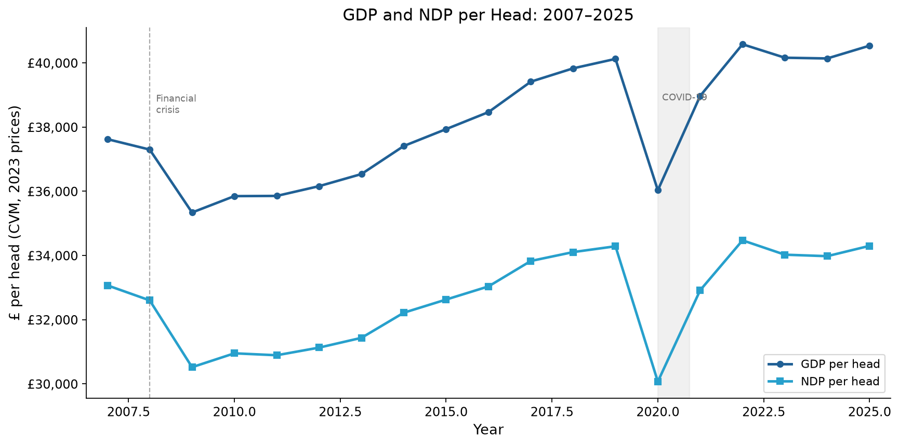
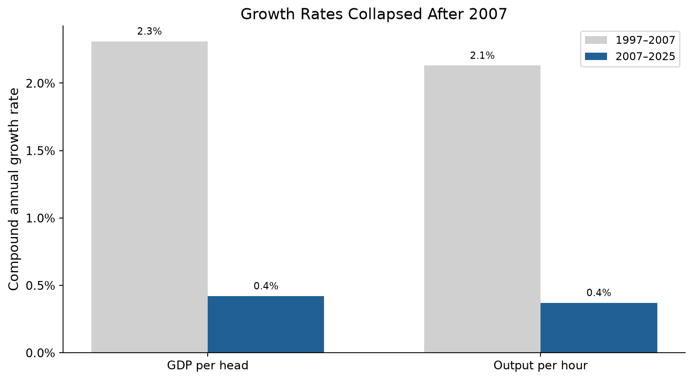
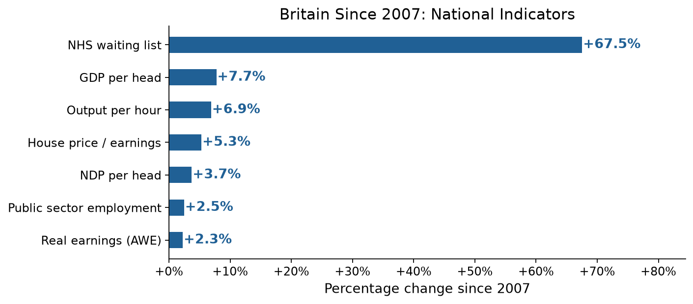
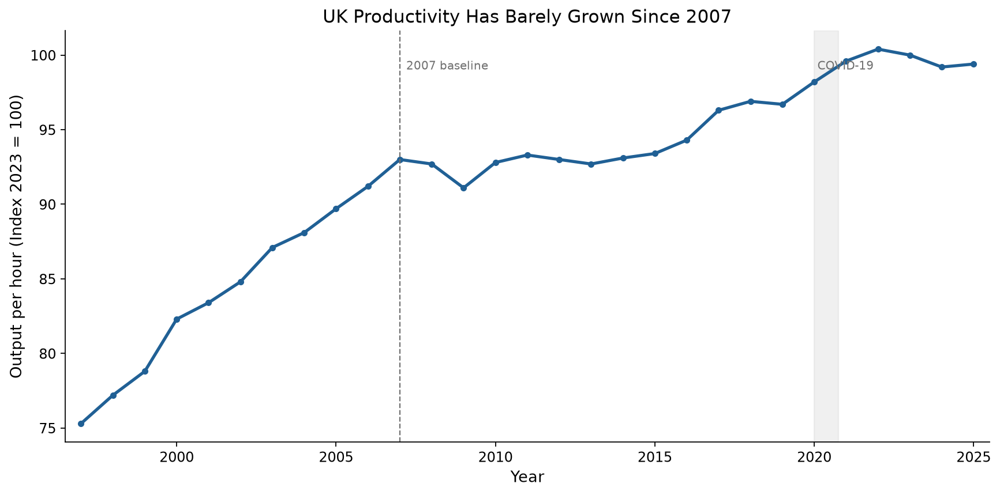
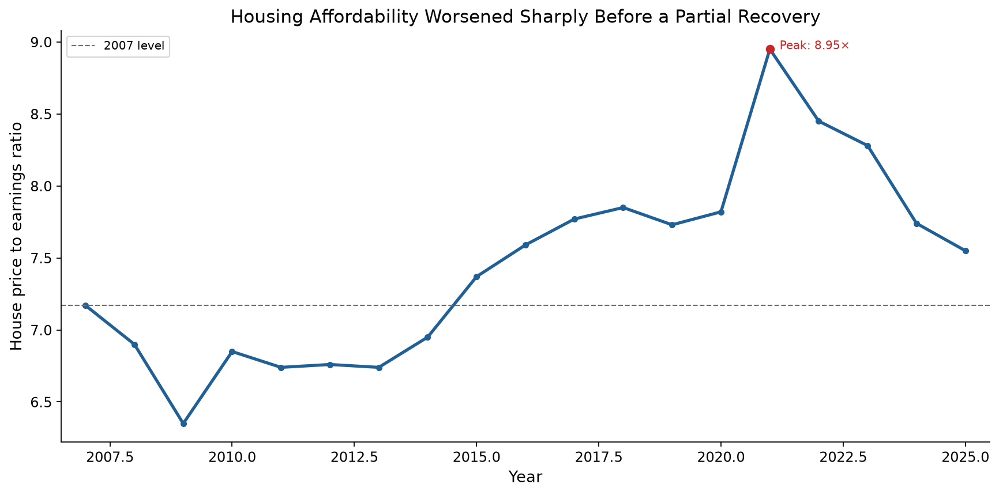
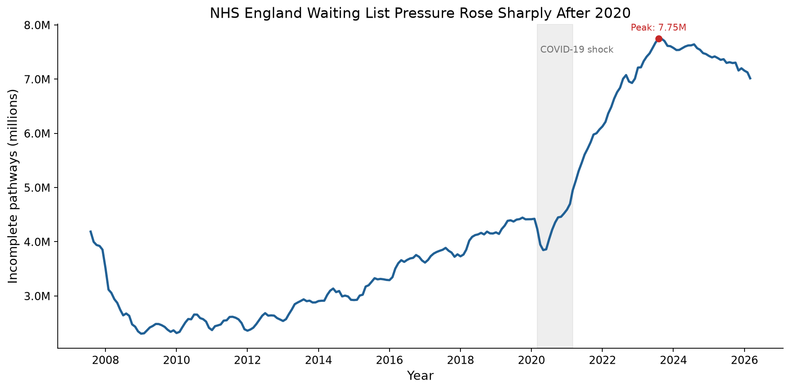
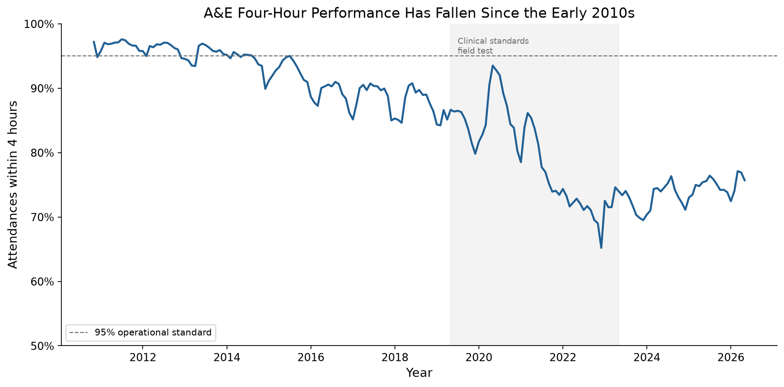
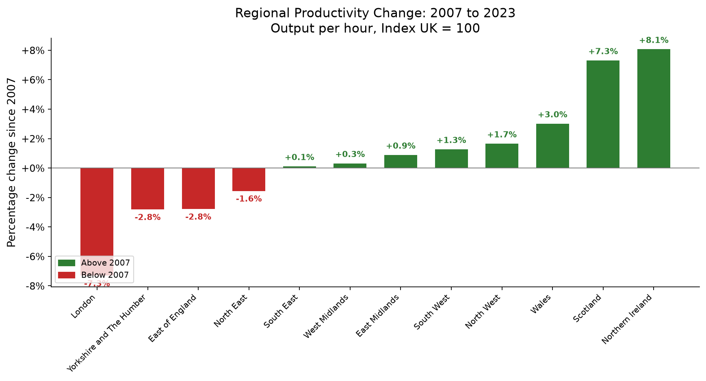
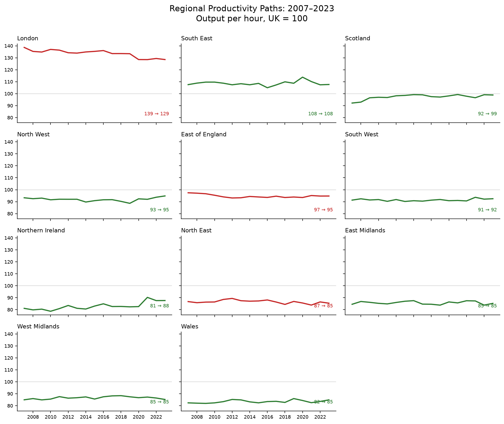
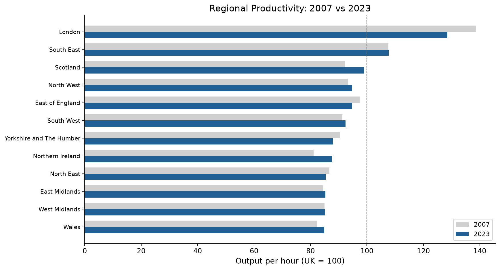

# Britain Since 2007: Evidence Report

UK Economic Change Comparison Framework — Evidence Pack  
July 2026 | Data sources: Office for National Statistics and NHS England

---

## Executive summary

This report compares Britain's economy in 2007, the peak before the global financial crisis, with the latest data available. It draws on 7 national indicators, one A&E extension and 12 regional productivity measures, taken from the Office for National Statistics and NHS England and processed through a reproducible pipeline.

### Main findings

- GDP per head rose from £37,625 in 2007 to £40,537 in 2025. That is a gain of 7.7% over 18 years, or 0.4% per year. Before the crisis, growth averaged 2.3% per year.
- Net domestic product per head grew at less than half that rate (3.7%). This suggests that capital consumption (the cost of depreciation and obsolescence) absorbed a growing share of Britain's output.
- Output per hour worked, the standard measure of labour productivity, rose only 6.9% over the same period. Before 2007, productivity grew at 2.1% per year.
- Real earnings (pay adjusted for inflation) grew by 2.3%, or £16 per week in 2025 prices. GDP per head grew by 7.7% over the same period. The economy produces more per person, but the average worker's real pay has barely moved.
- Housing affordability has been under sustained pressure. The ratio of house prices to earnings rose from 7.2 (2007) to a peak of 8.95 (2021), before falling to 7.55 (2025). The 5-year average of 8.19 shows that affordability was much worse than in 2007 for most of the post-crisis period.
- NHS waiting lists have grown sharply. Total incomplete pathways rose from 4.19 million (August 2007) to 7.01 million (March 2026) — an increase of 67.5%. The list peaked at 7.75 million in August 2023 before falling, but it remains far above its pre-COVID level.
- A&E performance has worsened. The share of attendances completed within 4 hours fell from 96.8% in 2011 to 74.7% in 2025. There is no 2007 baseline in the current monthly A&E series, so this evidence is partial.
- Public sector employment has grown slightly in headcount terms. Total UK public sector employment rose from 6.03 million in 2007 to 6.18 million in 2025, an increase of 149,000 or 2.5%. But public sector employment fell as a share of all employment, from 20.5% to 18.0%.
- Regional inequality is narrowing, but slowly. Scotland and Northern Ireland recorded the strongest convergence gains, while London's relative advantage shrank. But London is still nearly 29% above the UK average.

Britain's post-2007 economic performance is not a dip that will revert. It is a break from the pre-crisis trend. After 18 years, the data is unambiguous: the old growth trajectory has not returned.

---

## 1. National output: GDP per head

### The main figure

Real GDP per head stood at £37,625 in 2007. By 2025, it had risen to £40,537 — an increase of £2,912, or 7.7%.

|                                 | 2007    | 2025    | Change          |
| ------------------------------- | ------- | ------- | --------------- |
| GDP per head (CVM, 2023 prices) | £37,625 | £40,537 | +£2,912 (+7.7%) |

### The trend matters more than the main figure

The total change tells you less than the trend. Between 1997 and 2007, GDP per head grew at a compound annual rate of 2.3%. Had that trend continued, GDP per head would be roughly £55,000 today. The gap is about £14,500 per person.

Instead, the compound annual growth rate since 2007 has been just 0.4% — a near-total collapse in the pre-crisis trend.



Figure 1: GDP and NDP per head, 2007 to 2025, chained volume measures at 2023 prices. The chart shows four phases: the 2008-2009 financial crisis contraction, a slow recovery through the 2010s, the 2020 COVID shock, and a modest post-pandemic recovery. NDP per head (GDP minus capital consumption) sits below GDP throughout, and the gap widens over time.



Figure 2: Compound annual growth rates before and after 2007 for GDP per head and output per hour. GDP per head growth fell from 2.3% a year in 1997 to 2007 to 0.4% a year in 2007 to 2025. Output per hour growth fell from 2.1% to 0.4% a year. This is the clearest single summary of the post-2007 slowdown.

### Why it matters

A 0.4% annual growth rate means GDP per head doubles roughly every 175 years. At the pre-2007 rate of 2.3%, it would double every 30 years. The gap between 0.4% and 2.3% is the difference between stagnation and growth. It directly affects living standards, public finances, and fiscal sustainability.

---

## 2. National income: NDP per head

### GDP is not the whole story

Gross Domestic Product measures total output, but it does not account for the wear and tear on the capital stock that produces that output. Net Domestic Product (NDP) subtracts capital consumption (depreciation of buildings, machinery, infrastructure, and intellectual property) to give a measure closer to sustainable national income.

|                                 | 2007    | 2025    | Change          |
| ------------------------------- | ------- | ------- | --------------- |
| NDP per head (CVM, 2023 prices) | £33,070 | £34,300 | +£1,230 (+3.7%) |

NDP per head grew by only 3.7% — less than half the rate of GDP per head. The gap between GDP and NDP per head widened from £4,555 in 2007 to £6,237 in 2025.

### Interpretation

This widening gap suggests that a growing share of Britain's economic output goes into capital consumption — maintaining, replacing, and depreciating the existing capital stock — rather than generating new net income. Several factors may contribute:

- An ageing capital stock that costs more to maintain.
- Shorter asset lives in technology-intensive industries.
- Measurement changes in how capital consumption is estimated.
- Genuinely higher depreciation rates in a more service-oriented economy.

Whatever the cause, the growing gap means GDP per head overstates the improvement in sustainable living standards since 2007 by a factor of roughly 2.



Figure 3: Percentage change in the 7 national indicators since 2007. The NHS waiting list (+67.5%) is the largest change by far. GDP per head (+7.7%), output per hour (+6.9%), house price to earnings ratio (+5.3%), NDP per head (+3.7%), public sector employment (+2.5%) and real earnings (+2.3%) show much smaller changes. The gap between output and living standards has widened.

---

## 3. Productivity: output per hour worked

### The stagnation is real

Labour productivity (output per hour worked) is the foundation of long-run improvements in living standards. Productivity growth is what allows wages to rise without stoking inflation, tax revenues to increase without rate rises, and cost pressures to be absorbed without losing competitiveness. Without it, those things become trade-offs.

|                                  | 2007 | 2025 | Change           |
| -------------------------------- | ---- | ---- | ---------------- |
| Output per hour (Index 2023=100) | 93.0 | 99.4 | +6.4 pts (+6.9%) |

Output per hour worked rose 6.9% over 18 years — a compound rate of about 0.4% per year. Before the crisis (1997 to 2007), productivity grew at 2.1% per year.



Figure 4: Output per hour worked, 1997 to 2025, index 2023 = 100. The chart shows strong pre-crisis growth followed by a long period of weak growth, interrupted by the 2020 COVID shock and recovery.

### Why productivity growth has been so slow

The UK's post-2007 productivity record is now approaching two decades of near-stagnation. If you want to understand why Britain feels poorer than it did, start here. This is structural, not cyclical. Nothing else about the economy in this period matters as much.

To put the numbers in perspective:

- If pre-2007 productivity growth had continued, output per hour would be roughly 135 on the 2023=100 index today, rather than 99.4.
- The cumulative output "lost" to the productivity slowdown is measured in trillions of pounds.
- The productivity gap relative to comparable economies (US, Germany, France) is well-documented in the academic literature. We do not recalculate it here, but the domestic trend alone is clear enough.

### Evidence rating: strong

The claim that "productivity growth has been weak since 2007" is supported by clear, consistent, and officially-sourced data. The 2007 baseline is unambiguous. The measure (output per hour, whole economy) is the standard international metric. The source (ONS PRDY dataset, CDID LZVB) is transparent and regularly updated.

---

## 4. Real earnings: the living standards disconnect

### The main finding

Real average weekly earnings (nominal pay deflated by the Consumer Prices Index) rose from the equivalent of £711 per week in 2007 to £727 per week in 2025 (both in 2025 prices). That is a gain of £16 per week, or 2.3%, over 18 years.

|                        | 2007    | 2025    | Change         |
| ---------------------- | ------- | ------- | -------------- |
| Real AWE (2025 prices) | £711/wk | £727/wk | +£16 (+2.3%)   |
| Nominal AWE            | £420/wk | £727/wk | +£307 (+73.1%) |
| CPI (2015=100)         | 81.8    | 138.4   | +69.2%         |

### Why this matters

The gap between earnings and output is wide:

| Measure             | Change since 2007 |
| ------------------- | ----------------- |
| GDP per head        | +7.7%             |
| Output per hour     | +6.9%             |
| NDP per head        | +3.7%             |
| Real earnings (AWE) | +2.3%             |

Real earnings grew at less than one-third the rate of GDP per head. The economy produces 7.7% more per person than it did in 2007, but the average worker's real pay has risen only 2.3%. This is the main gap in the post-2007 British economy.

### Methodology note

We compute real earnings by deflating nominal Average Weekly Earnings (ONS series KAB9, whole economy, total pay, seasonally adjusted) by the Consumer Prices Index all-items index (ONS series D7BT, 2015=100). Both series are annual observations. We convert the 2007 nominal value to 2025 prices using the ratio of CPI indices.

This approach is standard in economic analysis. It produces results consistent with ONS-published real AWE series, and it gives the project full control over the reference year and computation.

### Evidence rating: strong

The claim that "living standards changed differently from GDP per head" (C006) is rated strong. Real earnings grew only 2.3% while GDP per head grew 7.7%. The data comes from ONS official series with transparent methodology.

---

## 5. Housing affordability

### The main finding

The ratio of median house prices to median gross annual workplace-based earnings in England and Wales stood at 7.17 in 2007. By 2025 it had risen to 7.55 — an increase of 5.3%.

|                               | 2007  | 2025  | Change        |
| ----------------------------- | ----- | ----- | ------------- |
| House price to earnings ratio | 7.17× | 7.55× | +0.38 (+5.3%) |

### The endpoint understates the problem

The simple 2007 to 2025 comparison hides a much more painful path:

| Period                        | Ratio |
| ----------------------------- | ----- |
| 2007 (pre-crisis peak)        | 7.17× |
| 2009 (post-crisis trough)     | 6.35× |
| 2015                          | 7.37× |
| 2021 (peak)                   | 8.95× |
| 2023                          | 8.28× |
| 2025                          | 7.55× |
| 5-year average (2021 to 2025) | 8.19× |

Housing affordability worsened steadily from 2014 onwards. It peaked in 2021 at a ratio nearly 25% worse than 2007. The fall to 7.55 by 2025 reflects both cooling house prices and earnings growth. But the 5-year average of 8.19 shows that for most of the recent period, affordability was much worse than in 2007.



Figure 5: Median house price to median workplace-based earnings ratio, England and Wales, 2007 to 2025. The endpoint comparison understates the deterioration because affordability worsened most between 2015 and 2021 before partially recovering.

### Interpretation

A ratio of 7.55 means the median house costs 7.55 times the median annual salary — far above traditional lending multiples and historic norms. At the 2021 peak of 8.95, a median earner would need to spend nearly 9 years of gross salary to buy a median-priced home, before any other living costs.

Do not mistake the partial recovery since 2021 for a return to pre-crisis affordability. The 2007 ratio was already considered high at the time. That it has stayed above 7.0 for most of the past decade — and above 8.0 for 2021 to 2023 — means housing access for median earners has structurally worsened.

### Evidence rating: partial

The claim that "housing pressure has worsened since 2007" (C007) is rated partial. The endpoint comparison alone (+5.3%) gives only modest support to the claim. But the full time series — with a peak at 8.95 and a 5-year average of 8.19 — provides much stronger evidence. The rating is partial because the endpoint hides how bad affordability became during 2015 to 2023.

### Data note

This indicator covers England and Wales only, not the whole UK. Scotland and Northern Ireland have separate land registries and housing market data that this ONS dataset does not include. The ratio uses median (not mean) values for both house prices and earnings, so that unusual values do not distort the result.

---

## 6. NHS waiting times

### The main finding

The NHS England total waiting list for consultant-led referral to treatment (RTT) — measured as total incomplete pathways — stood at 4.19 million in August 2007, the first month of RTT data collection. By March 2026 it had risen to 7.01 million — an increase of 67.5%.

|                           | Aug 2007  | Mar 2026  | Change              |
| ------------------------- | --------- | --------- | ------------------- |
| Total incomplete pathways | 4,186,974 | 7,014,879 | +2,827,905 (+67.5%) |

### The trajectory

The waiting list followed a distinct pattern over the period:

| Period   | Waiting list | Context                                     |
| -------- | ------------ | ------------------------------------------- |
| Aug 2007 | 4.19M        | First month of RTT data; pre-18-week target |
| Mar 2010 | 2.42M        | Post-target low point                       |
| Mar 2015 | 3.01M        | Gradual increase                            |
| Mar 2020 | 4.24M        | Pre-COVID level                             |
| Aug 2023 | 7.75M        | Post-COVID peak                             |
| Mar 2026 | 7.01M        | Latest point                                |

The waiting list fell sharply after the 18-week referral-to-treatment target was introduced in 2008. It reached a low of 2.36 million in 2009. It then rose gradually through the 2010s, returning to roughly 2007 levels by 2019. The COVID-19 pandemic caused a surge as elective procedures were cancelled and new referrals accumulated. The list rose from 4.24 million in March 2020 to a peak of 7.75 million in August 2023, then fell to 7.01 million by March 2026.



Figure 6: NHS England RTT incomplete pathways, August 2007 to March 2026. The chart uses monthly observations and does not interpolate across missing periods. The waiting list fell after the 18-week target was introduced, rose gradually through the 2010s, increased sharply after the COVID-19 shock, and then partly declined after its 2023 peak.

### Interpretation

A 67.5% increase in the waiting list over 19 years means NHS access has become much worse, though the picture has some wrinkles.

- The 2007 baseline is the first month of RTT data, not a stable pre-crisis level. The list was already considered high, which is why the 18-week target was introduced.
- The post-2020 surge is largely driven by COVID — a shock to the whole system, not steady worsening. The pre-COVID trend from 2010 to 2020 was upward but much gentler.
- The data covers England only. Scotland, Wales, and Northern Ireland have their own NHS systems.

The direction is clear despite these caveats: NHS waiting list pressure is substantially worse than in 2007, even after the partial fall from the 2023 peak.

### Evidence rating: strong

The claim that "public service pressure (NHS waiting list) has increased substantially since 2007" (C008) is rated strong. The data comes from NHS England official statistics, has a clear baseline, and shows a large and sustained increase.

### Data note

We compiled this data from NHS England RTT monthly incomplete-pathway releases where available, using the same measure throughout: total incomplete pathways, England, commissioner basis. For older periods not available through the current monthly pages, we retain the NHS historical RTT time-series values. Incomplete pathway data starts in August 2007, so there is no like-for-like pre-August 2007 value for this measure. We store the combined monthly series in `data/raw/nhs_waiting_list.csv` (224 observations). NHS England is an official UK statistical authority. Our data principle permits supplementary official sources where ONS does not cover the required measure.

---

## 7. A&E waiting times

### The main finding

The share of A&E attendances completed within 4 hours in England fell from an annual average of 96.8% in 2011 to 74.7% in 2025. That is a fall of 22.1 percentage points.

| Measure                        | 2011  | 2025  | Change                  |
| ------------------------------ | ----- | ----- | ----------------------- |
| A&E attendances within 4 hours | 96.8% | 74.7% | −22.1 percentage points |



Figure 7: Percentage of A&E attendances in England discharged, admitted or transferred within 4 hours, November 2010 to May 2026. The 2011 and 2025 figures in the table use annual averages so the comparison is not distorted by month-to-month volatility.

### Interpretation

A&E performance has weakened substantially since the early 2010s. The decline is not a COVID-only story. Performance was already below the 95% operational standard before 2020, then fell further after the pandemic.

The indicator broadens the public-service evidence base. NHS waiting lists measure elective care pressure. A&E four-hour performance measures urgent and emergency care pressure.

### Evidence rating: partial

The evidence is partial because there is no 2007 baseline in the current monthly A&E time series. The nearest defensible full-year baseline is 2011. NHS England also warns that monthly values before June 2015 are estimated from weekly data, and that May 2019 to May 2023 four-hour performance excludes clinical standards field-test trusts.

### Data note

We use NHS England A&E Attendances and Emergency Admissions data. The measure covers England only and includes all A&E types. The source reports the number of attendances discharged, admitted or transferred within 4 hours of arrival.

---

## 8. Public sector employment

### The main finding

Total UK public sector employment rose from 6.03 million in 2007 to 6.18 million in 2025. That is an increase of 149,000 people, or 2.5%.

| Measure | 2007 | 2025 | Change |
| --- | --- | --- | --- |
| Public sector employment | 6.03M | 6.18M | +149,000 (+2.5%) |
| Public sector share of total employment | 20.5% | 18.0% | −2.5 percentage points |
| Public sector employment excluding major reclassifications | 5.58M | 5.93M | +350,000 (+6.3%) |

### Interpretation

The claim that the public sector has grown is true in headcount terms, but only modestly for the headline total public sector series.

The qualification matters. Public sector employment fell as a share of total employment, from 20.5% in 2007 to 18.0% in 2025. That means the public sector employs more people than in 2007, but it is smaller relative to the whole labour market.

The composition also changed. Central government employment rose from 2.71 million to 4.05 million. Local government employment fell from 2.95 million to 1.97 million. Some of this reflects changes in classification and responsibility rather than a simple shift in service capacity.

### Evidence rating: partial

The evidence is partial because the answer depends on the denominator and classification. The headcount rose. The employment share fell. Reclassifications affect the headline public sector series, so we also check the series excluding major reclassifications.

### Data note

We use the ONS Public sector employment time series, dataset PSE. The headline measure is total public sector employment, UK, headcount, seasonally adjusted. The source is official and gives a clean 2007 baseline.

---

## 9. Regional productivity

### The picture across Britain

Regional productivity — measured as output per hour relative to the UK average (UK = 100) — tells a story of uneven but real convergence since 2007.

| Region                   | 2007  | 2023  | Change | Direction   |
| ------------------------ | ----- | ----- | ------ | ----------- |
| Northern Ireland         | 81.1  | 87.6  | +6.5   | ▲ Gaining   |
| Scotland                 | 92.2  | 98.9  | +6.7   | ▲ Gaining   |
| Wales                    | 82.4  | 84.9  | +2.5   | ▲ Gaining   |
| North West               | 93.2  | 94.8  | +1.5   | ▲ Gaining   |
| South West               | 91.3  | 92.5  | +1.2   | ▲ Gaining   |
| East Midlands            | 84.5  | 85.3  | +0.7   | ▲ Gaining   |
| West Midlands            | 84.9  | 85.2  | +0.3   | ▲ Gaining   |
| South East               | 107.5 | 107.7 | +0.1   | → Stable    |
| North East               | 86.8  | 85.4  | −1.4   | ▼ Declining |
| Yorkshire and The Humber | 90.4  | 87.9  | −2.5   | ▼ Declining |
| East of England          | 97.4  | 94.7  | −2.7   | ▼ Declining |
| London                   | 138.7 | 128.5 | −10.1  | ▼ Declining |



Figure 8: Percentage change in regional output per hour relative to the UK average (UK = 100), 2007 to 2023.

### Convergence is happening, but slowly

The regional data tells a more complicated story than the headline convergence figure suggests.

- The lowest-productivity regions in 2007 improved the most. Northern Ireland (+8.1%), Scotland (+7.3%), and Wales (+3.0%), all below the UK average in 2007, recorded the strongest gains. This suggests the regions that started furthest behind are closing some of the gap.
- London's advantage is shrinking, not growing. London's output per hour fell from 38.7% above the UK average to 28.5% above. This is the largest single change in the dataset. It is the opposite of what you would see if London were pulling further ahead. London is still far ahead of every other region, but the gap is narrowing.
- 5 regions lost ground. The North East, Yorkshire and The Humber, and the East of England (all in the middle of the distribution in 2007) saw their relative position decline. These are not the very poorest regions (which gained), nor the richest (London, which declined), but the middle. This pattern needs a closer look in a larger study.

### Measuring convergence

The standard deviation of regional output per hour fell from 15.1 in 2007 to 12.2 in 2023 — a reduction of about 19%. This shows that the spread of productivity outcomes across regions has narrowed, even as the absolute level of productivity growth has been weak nationally.



Figure 9: Regional output per hour paths, 2007 to 2023, UK = 100. The small multiples show how convergence happened: some lower-productivity regions gained ground, while London remained far ahead but moved closer to the UK average.



Figure 10: Regional output per hour relative to the UK average (UK = 100), comparing 2007 and 2023 positions. Regions sorted by 2023 value. The pattern shows convergence at both ends — the lowest-ranked regions in 2007 gained ground, while London's advantage narrowed.

### Evidence rating: partial

The claim that "regional productivity inequality persists" is rated partial. The data shows both convergence (narrower spread, gains at the bottom) and persistence (London still far ahead, some middle regions losing ground). The picture is too mixed for a simple "inequality persists" or "convergence is happening" frame.

---

## 10. Claims-evidence matrix

The claims-evidence matrix links broad policy and media claims to specific indicators and assesses whether the data supports them.

| Claim                                                                                   | Evidence rating | What the data shows                                                                                                                                                                                                                                                                                         |
| --------------------------------------------------------------------------------------- | --------------- | ----------------------------------------------------------------------------------------------------------------------------------------------------------------------------------------------------------------------------------------------------------------------------------------------------------- |
| C001: Britain's output per person has changed materially since 2007                     | Strong          | GDP per head rose 7.7% (£37,625 → £40,537). It has changed materially, but the direction and size of the change represent a collapse from pre-crisis trends.                                                                                                                                                |
| C002: National income per head has changed materially since 2007                        | Strong          | NDP per head rose 3.7% — less than half the GDP gain. The growing gap suggests capital consumption is absorbing more output.                                                                                                                                                                                |
| C003: Productivity growth has been weak since 2007                                      | Strong          | Output per hour rose 6.9% over 18 years (~0.4% pa), compared with ~2% pa before the crisis. The weakness is structural, not cyclical.                                                                                                                                                                       |
| C004: Regional productivity inequality persists                                         | Partial         | 7 regions improved their relative position; 5 declined. The overall spread narrowed (std dev 15.1 → 12.2), but London remains far ahead of every other region and middle-ranked regions show signs of relative decline.                                                                                     |
| C005: London is far more productive than other regions                                  | Strong          | London output per hour is 28.5% above the UK average, down from 38.7% in 2007. The gap is narrowing but London is still by far the most productive region.                                                                                                                                                  |
| C006: Living standards changed differently from GDP per head                            | Strong          | Real earnings (CPI-deflated AWE) rose only 2.3% since 2007, compared with GDP per head growth of 7.7%. The average worker's real pay has barely improved while output per person has grown.                                                                                                                 |
| C007: Housing pressure has worsened since 2007                                          | Partial         | Median house price to earnings ratio rose from 7.2× (2007) to 7.55× (2025), but peaked at 8.95× in 2021 before declining. The 5-year average of 8.19× shows sustained pressure above 2007 levels, though the endpoint comparison alone hides how bad affordability became during 2015 to 2023.              |
| C008: Public service pressure (NHS waiting list) has increased substantially since 2007 | Strong          | NHS England waiting list rose from 4.19M (Aug 2007) to 7.01M (Mar 2026), a 67.5% increase. Post-COVID backlog accounts for much of the increase, but the pre-COVID trend was already upward (2.4M in 2010 to 4.2M in 2020). Data covers England only.                                                       |
| C009: A&E performance has worsened since the early 2010s                                | Partial         | A&E attendances completed within 4 hours fell from an annual average of 96.8% in 2011 to 74.7% in 2025, a fall of 22.1 percentage points. Evidence is partial because there is no 2007 baseline and comparability caveats apply before June 2015 and during the 2019 to 2023 clinical standards field test. |
| C010: Public sector employment has grown since 2007                                     | Partial         | Public sector employment rose from 6.03M in 2007 to 6.18M in 2025, an increase of 149,000 or 2.5%. But public sector employment fell as a share of total employment, from 20.5% to 18.0%. Reclassifications affect the headline series.                                         |

---

## 11. What is still left

The framework now covers real earnings, housing affordability, NHS waiting-list pressure, A&E performance and public sector employment alongside output, income, productivity and regional productivity. The remaining gaps are narrower — mostly about coverage, detail and the question of why things changed.

- Distributional living standards. We now measure real earnings through CPI-deflated Average Weekly Earnings (+2.3% since 2007), but GDP per head and AWE are averages. Household disposable income, income inequality, poverty, and wealth measures would show how gains and losses were distributed.
- Full UK housing coverage. We now measure housing affordability through the house price to earnings ratio, but the ONS series covers England and Wales only. Scotland and Northern Ireland remain outside the housing indicator. Phase 5 reviewed official sources and did not find a directly comparable four-nation price-to-earnings ratio.
- Broader public-service pressure. We now measure NHS waiting times and A&E four-hour performance for England. Phase 5 reviewed social care, local authority spending power, courts and schools, but did not add them because the available official series do not support a clean 2007-to-latest comparison for this pack.
- Public sector scale. We now measure public sector employment. Public spending, public service output and public service productivity remain outside the current scope.
- International comparisons. The domestic productivity trend is clear, but placing it in an international context would strengthen the analysis.
- Sub-regional variation. City-region and local authority breakdowns would reveal variation hidden by ITL1 regional averages.
- Policy attribution. This framework measures what happened, not why. To explain changes with reference to specific policies, external shocks, or structural shifts would need a different analytical approach.

We document these gaps in `docs/future-plan.md`. Most of the original roadmap is now complete. The remaining work is best treated as extensions to the finished core evidence pack.

---

## 12. Methodology

### Data sources

We took data from the Office for National Statistics and NHS England. Most source files are downloaded automatically. The NHS waiting-list CSV is tracked in the repository because it combines current monthly releases with older historical time-series values.

| Indicator                              | ONS code    | Dataset                                     | Latest |
| -------------------------------------- | ----------- | ------------------------------------------- | ------ |
| Real GDP per head                      | IHXW        | UK Economic Accounts (UKEA)                 | 2025   |
| Real NDP per head                      | MWB6        | UK Economic Accounts (UKEA)                 | 2025   |
| Output per hour worked                 | LZVB        | Labour productivity (PRDY)                  | 2025   |
| Real average weekly earnings           | KAB9 + D7BT | Labour Market Statistics (LMS) + CPI (MM23) | 2025   |
| House price to earnings ratio          | —           | Housing affordability (England and Wales)   | 2025   |
| NHS waiting list (incomplete pathways) | —           | NHS England RTT data                        | 2026   |
| A&E attendances within 4 hours         | —           | NHS England A&E data                        | 2025   |
| Public sector employment               | G7AU        | Public sector employment (PSE)              | 2025   |
| Regional output per hour               | —           | Regional labour productivity (PRODBYREG)    | 2023   |

All national values are Chained Volume Measures (CVM) at 2023 reference prices, seasonally adjusted. Regional values are expressed as an index relative to the UK average (UK = 100).

### Calculation

For each indicator:

```
absolute_change = latest_value − baseline_value
percentage_change = (absolute_change / baseline_value) × 100
compound_annual_growth_rate = (latest_value / baseline_value)^(1/years) − 1
```

### Reproducibility

You can rebuild the entire evidence base from source with 3 commands:

```bash
make fetch     # download ONS data
make process   # standardise into processed tables
make build     # generate tables, charts, and claims matrix
```

All source code is in `src/`. Raw data is cached in `data/raw/`. Methodology is documented in `docs/methodology-note.md`.

### Limitations

- Regional productivity data lags national data by 1 to 2 years (latest: 2023 versus 2025 or 2026).
- We measure labour productivity as an index (2023=100), not in GBP per hour. This limits direct comparison with GDP per head figures.
- The ONS v0 API was retired in November 2024. This project uses the generator CSV and direct file endpoints instead. These endpoints may change without notice.
- NDP per head data (MWB6) starts from 1998. Earlier comparisons are not possible.
- Housing affordability data covers England and Wales only, not Scotland or Northern Ireland.
- NHS waiting list data covers England only. The 2007 baseline is the first month of RTT data collection (August 2007), which is not necessarily a "normal" pre-crisis level.
- A&E four-hour performance data covers England only. The nearest full-year baseline is 2011, not 2007. Monthly values before June 2015 are estimated from weekly data. May 2019 to May 2023 performance data excludes clinical standards field-test trusts.
- Public sector employment is UK-wide, headcount and seasonally adjusted. Reclassifications affect the headline total public sector series, so the report also checks public sector employment as a share of total employment and the excluding-major-reclassifications series.
- ONS and NHS England statistics can be revised. The values in this report reflect the latest available source files as of July 2026.

---

## Appendix: building the evidence base

We built this evidence pack in 5 phases:

| Phase | Description                                                                | Document                  |
| ----- | -------------------------------------------------------------------------- | ------------------------- |
| 1     | Data source discovery — confirmed working ONS endpoints for all indicators | `docs/project-history.md` |
| 2     | Fetch layer — download module that caches data                             | `docs/project-history.md` |
| 3     | Data processing — standardising raw data into consistent formats           | `docs/project-history.md` |
| 4     | Charts, claims matrix and validation                                       | `docs/project-history.md` |
| 5     | Documentation and final polish                                             | This report               |

The full project structure, Makefile commands, and documentation index are in `README.md`.

---

UK Economic Change — Britain Since 2007: Evidence Framework.  
Office for National Statistics and NHS England data, sourced July 2026. All values subject to revision.
